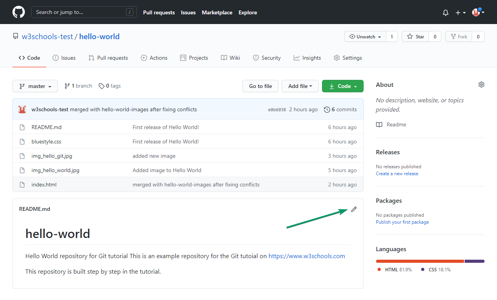
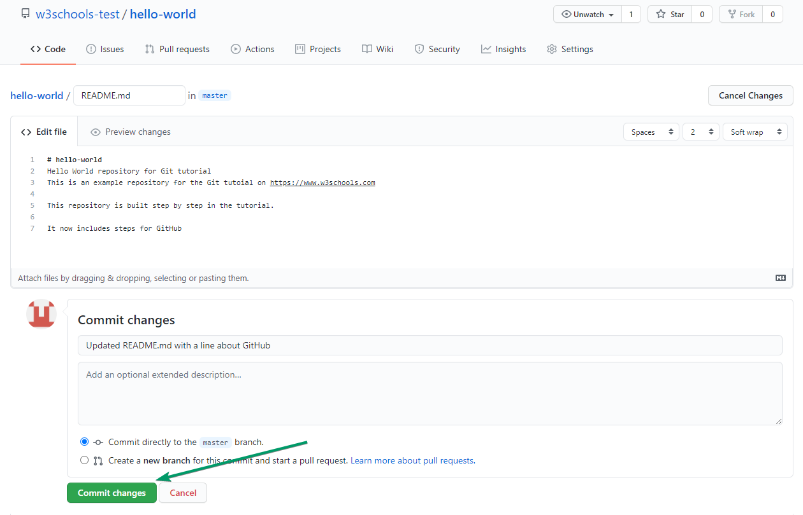

# Git GitHub Edit Code

## Edit Code in GitHub
In addition to being a host for Git content, GitHub has a very good code editor.
Let's try to edit the `README.md` file in GitHub. Just click the edit button:

Add some changes to the code, and then `commit` the changes. For now, we will "Commit directly to the master branch".

Remember to add a description for the `commit`

That is how you edit code directly in GitHub!