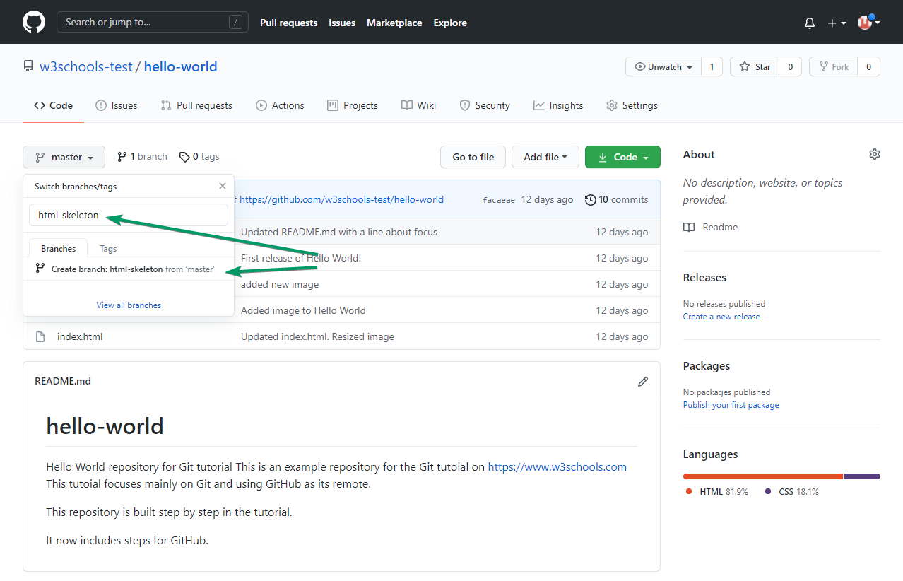

# Git GitHub Branch

## Create a New Branch on GitHub

On GitHub, access your repository and click the "master" branch button.

There you can create a new Branch. Type in a descriptive name, and click Create branch:

The `branch` should now be created and active. You can confirm which branch you are working on by looking at the branch button. See that it now says "html-skeleton" instead of "main"?

Start working on an existing file in this branch. Click the "index.html" file and start editing

After you have finished editing the file, you can click the "Preview changes" tab to see the changes you made highlighted

If you are happy with the change, add a comment that explains what you did, and click Commit changes.

You now have a new `branch` on GitHub, updated with some changes!