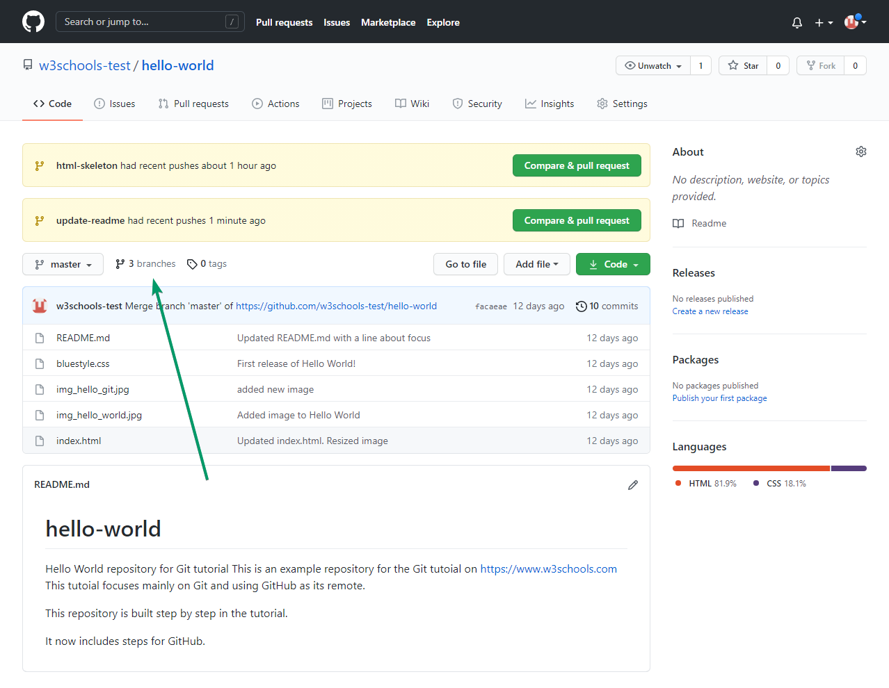
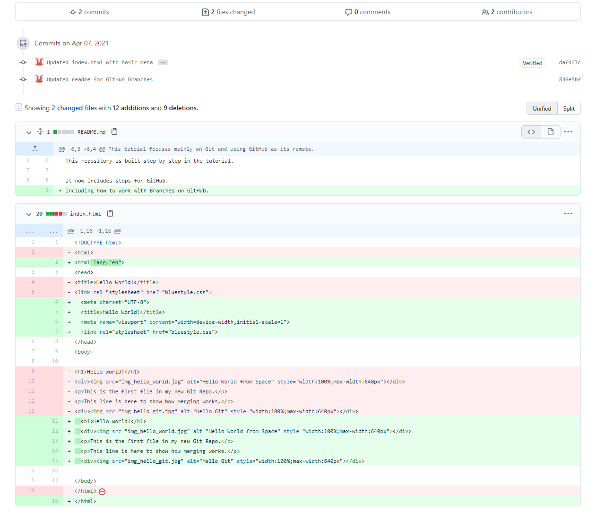

# Git Push Branch to GitHub

Let's try to create a new local branch, and push that to GitHub.

Start by creating a branch, like we did earlier:

```
git checkout -b update-readme
Switched to a new branch 'update-readme'
```
And we make some changes to the README.md file. Just add a new line.

So now we check the `status` of the current branch.

```
git status
On branch update-readme
Changes not staged for commit:
  (use "git add ..." to update what will be committed)
  (use "git restore ..." to discard changes in working directory)
        modified:   README.md

no changes added to commit (use "git add" and/or "git commit -a")
```

We see that README.md is modified but not added to the Staging Environment:

```
git add README.md
```

Check the status of the branch:

```
git status
On branch update-readme
Changes to be committed:
  (use "git restore --staged ..." to unstage)
        modified:   README.md
```

We are happy with our changes. So we will `commit` them to the `branch`:

```
git commit -m "Updated readme for GitHub Branches"
[update-readme 836e5bf] Updated readme for GitHub Branches
 1 file changed, 1 insertion(+)
```

Now `push` the `branch` from our local Git repository, to GitHub, where everyone can see the changes:

```
git push origin update-readme
Enumerating objects: 5, done.
Counting objects: 100% (5/5), done.
Delta compression using up to 16 threads
Compressing objects: 100% (3/3), done.
...
 * [new branch]      update-readme -> update-readme
```

Go to GitHub, and confirm that the repository has a new `branch`:



In GitHub, we can now see the changes and merge them into the master branch if we approve it.

If you click the "Compare & pull request", you can go through the changes made and new files added:



### Note: This comparison shows both the changes from update-readme and html-skeleton because we created the new branch FROM html-skeleton.

If the changes look good, you can go forward, creating a pull request:

A pull request is how you propose changes. You can ask some to review your changes or pull your contribution and merge it into their branch.

Since this is your own repository, you can  `merge` your pull request yourself:

The pull request will record the changes, which means you can go through them later to figure out the changes made.

To keep the repo from getting overly complicated, you can delete the now unused branch by clicking "Delete branch".

And after you confirm that the changes from the previous branch were included, delete that as well