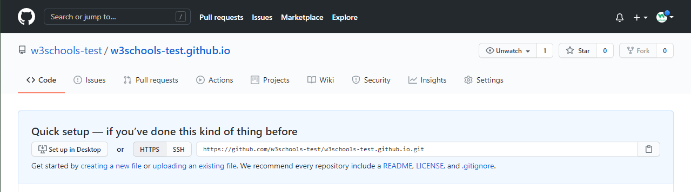
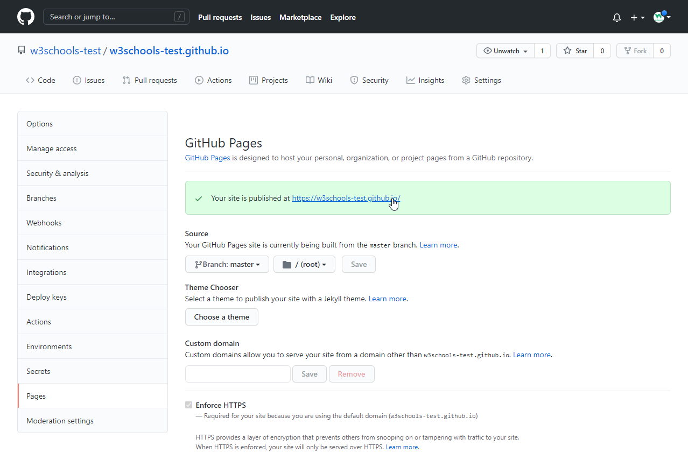

# Git GitHub Pages

## Host Your Page on GitHub

With GitHub pages, GitHub allows you to host a webpage from your repository. Let's try to use GitHub Pages to host our repository.

## Create a New Repository
* Start by signing in to GitHub. GitHub pages need a special name and setup to work, so we start by creating a new repository

* This repository needs a special name to function as a GitHub page. It needs to be your GitHub `username`, followed by `.github.io`

## Push Local Repository to GitHub Pages
We add this new repository as a remote for our local repository, we are calling it `gh-page` (for GitHub Pages).

Copy the `URL` from here:


And add it as a new `remote`:

```
git remote add gh-page <URL>
```

Make sure you are on the `master` `branch`, then push the `master` `branch` to the new remote:

```
git push gh-page master
Enumerating objects: 33, done.
Counting objects: 100% (33/33), done.
Delta compression using up to 16 threads
....
 * [new branch]      master -> master
```

### Note: If this is the first time you are connecting to GitHub, you will get some kind of notification to authenticate this connection.

Check that the new repository has received all the files

## Check Out Your Own GitHub Page
That looks good, now click the Settings menu and navigate to the Pages tab:


The GitHub page is created, and you can click the URL to view the result!